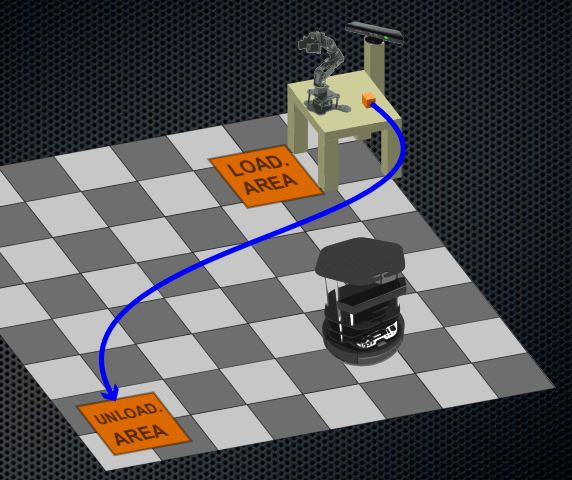
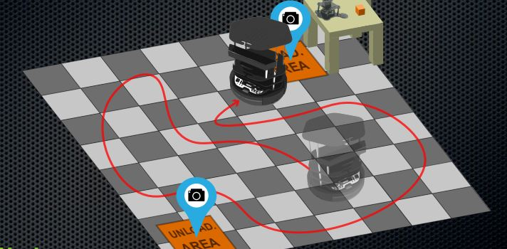
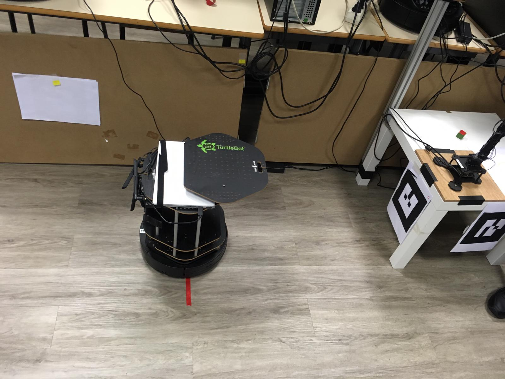
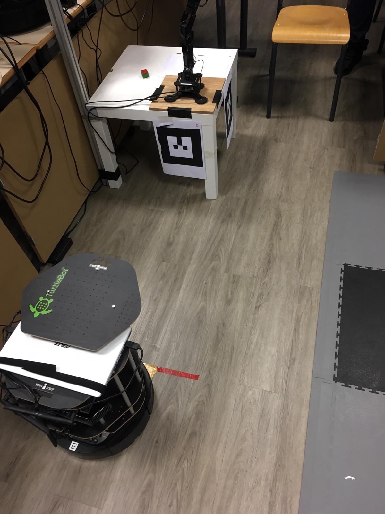

# Introduction

This project is for our course module in Robotics Engineering. 
The project main goal is to enable a robot (TurtleBot2) to pick up an Object from a location and Transport it to another Location. **Transportation will be done with the TurtleBot2** and the **Pick & Place with Robotic Arm (PhantomX Robot Arm)**. 

It is subdivided into different parts, each group is supposed to implement is own part and at the end make a fully autonomous scenario.

The channel is at follows:
1. Navigation
2. Mapping & Localization
3. Fine Positioning 
4. Pick & Place
5. Mapping & Localization

Our part is based on the **3rd channel (Fine Positioning)** . Using Visual Servoing techniques our robot must find the position of the target autonomously.
We describe in a brief technical survey report the different methods of **Visual Servoing**. You can find the pdf here [Technical Survey Report.](https://github.com/brown4eva/RoboticsEngineeringProject_FinePositioning/tree/master/TechnicalSurveyReport)
We will describe the method in which we used in achieving the task needed for our part.

# Problem Statement
Given any location of the robot(Turtlebot2) we are to position it at a specific location known as the load area. We are to exatcly put the Turtlebot2 in a postion where the robotic arm will be able to pick the cube and place it on the Turtlebot2.

  

# Objectives
In order to solve the problem statement we tasked ourselves with the below steps :

1. Creating  a Map
2. Navigate within the map created 
3. Going to specific location 
4. Creation of AR tag to give priori knowledge 
5. Detect, track and follow AR tag to perform Fine Positioning

# Implementation
We accomplished each task of the objectives stated in order to give a solution to the **Problem Statement** . 

**Step 1 to Step 3 :** 

These were just basic steps for us since we had hand experience with this during our Bachelor year.

If this is your first time being on this **ROS** platform please follow the steps we provided and assisted videos which will help in accomplishing the first three steps ==> [Creating_Map,Navigating_&_Going_To_Specific_Location.](https://github.com/brown4eva/RoboticsEngineeringProject_FinePositioning/tree/master/Implementations) We believe you will be able to have a hand in identifying the **Problem Statement** and also having the idea we used in solving the problem. If you are good to go then move to step 4.

**Step 4 :**

After we have now been able to have some prior knowledge on the where abouts of the robot by following the previous steps, our next step was now to go to the location needed for the loading of the object on the Turtlebot2. We did this by adapting to the method used by the **ROS by example book volume 2 Chapter 10, Detecting and Tracking AR Tags** .

We made use of the **ROS** package **ar_track_alvar**. This package can simplify a lot of the big questions and challenges that faces modern day high fidelity perception for robotic systems by the use of fiducials being **AR Tags**. In our case our problem was fine positioning which involves the field of perception (Computer Vision).

The **AR tags** allows us to estimate their position and orientation with respect to a camera frame based of their size in the image and their distortion. The **ar_track_alvar** library computes the projective transformations and spits out the tag’s position. We then make use of this information, which gives us knowledge and distance we need to make our Turtlebot2 to go to.

- In order to create the marker follow the steps provided here ==> [Creating Marker](https://github.com/brown4eva/RoboticsEngineeringProject_FinePositioning/tree/master/Implementations/Creation_of_Marker)

**Step 5 :**

After the AR tag as been created, we then print it out and paste it at the exact location being the **Load Area**. This will give us the prior knowledge, so all we need to do is just launch the **ar_track_alvar** node which utilize depth data from an RGB-D camera to assist
in the detection and localization of a marker and  will publish the pose on the topic **/ar_pose_marker**.

We then bring up the **ar_track_alvar** node with appropriate parameters for the large marker size we launch **ar_large_marker_kinect.launch** that you can found in the folder ==> [launch](https://github.com/brown4eva/RoboticsEngineeringProject_FinePositioning/tree/master/source_code/fine_positioning/launch) we then modify the size of the marker set by default to adapt it to our own marker, in our case we ajdust it to 18.5 cm.

The **ar_track_alvar** node will publish the marker pose relative to the base frame. Once the pose of the AR marker relative to the robot's base is known we now adjust the linear and angular speed through the script **ar_follower.py** that you can found in the directory ==> [nodes](https://github.com/brown4eva/RoboticsEngineeringProject_FinePositioning/tree/master/source_code/fine_positioning/nodes) which will cause the robot to follow the marker due to the subscription to the topic **/ar_pose_marker**.

**Set Up**

  

- Please do mind the positioning of the robot on the set up was due to the location we gave it when perfominng the navigation. After creating the map we then took the cordinates, using the topic **/amcl_pose**, of where we want it to be . We inserted the values in the body of the script **go_to_specific_point_on_map.py**.

- To perform the method we used for the fine positioning please follow these steps ==> [Fine Positioning](https://github.com/brown4eva/RoboticsEngineeringProject_FinePositioning/tree/master/source_code/fine_positioning)

**Video of Detection and Tracking of AR tag**

**Video of Fine Positioning**

**OBSERVATION**

The above videos show how the **AR tag** was detected and tracked after which the node **ar_follower** makes the TurtleBot2  to move towards it. Observing the video you could clearly see the speed of Turtlebot2 reduces when it gets closer to the tag this was due to the goal we set for the target we want to achieve. We made calculations with regards to the threshold and distance we want the camera to be with the **AR tag**.  Once the camera reaches the goal and distance we assigned with regards to the calculations made, the robot as to stop and output on the terminal **Target Achieved**.  Our method, in this case, becomes more Stationary unlike the original tag follower developed by **ROS by example volume 2**.  We adapted their method of the tag following and made to suit to solve our **Problem Statement**

# Conclusion

We were able to give a solution to the problem we stated above. We took the various steps we tasked ourselves to and got satisfactory results and in addition got clearer knowledge of Visual Servoing.

We tried to make this Repository to be detailed as we could and gave hidden links to the subfolders which are needed in performing the tasks. Please note to follow each step tasked in order to get results as we did.
 

## Authors
Meldrick Reimmer, Selma Boudisssa and Sonizara Danie

## Project Supervisors
Ralph Seulin, Raphael Duvern, Marc Blanchon and Thibault Clamens.

